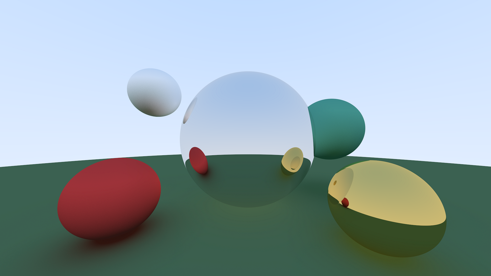
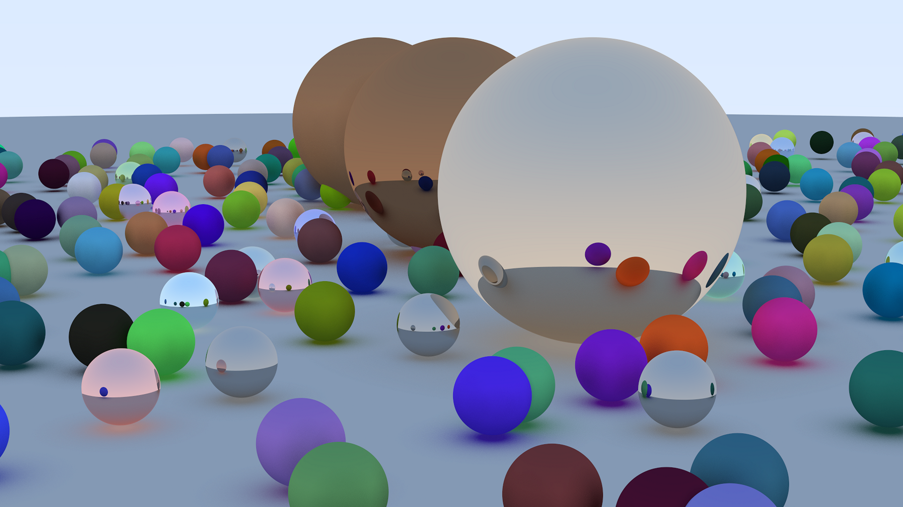

Just a simple raytracer in Rust using the CPU.

Showcase :

This rendering took 40 minutes on my laptop.

**Performance Benchmarks**

To evaluate the efficiency of different rendering pipelines, I compared the
execution times of several implementation strategies. All benchmarks were
executed using `cargo run --release`.

*   **Direct stdout stream:** 11.174s total (11.04s user)
*   **Buffered image-to-stdout:** 9.808s total (9.80s user)
*   **Binary P3 format implementation:** 9.503s total (9.48s user)

While the transition to binary output provided measurable performance gains,
the overall impact on total render time remains marginal.

