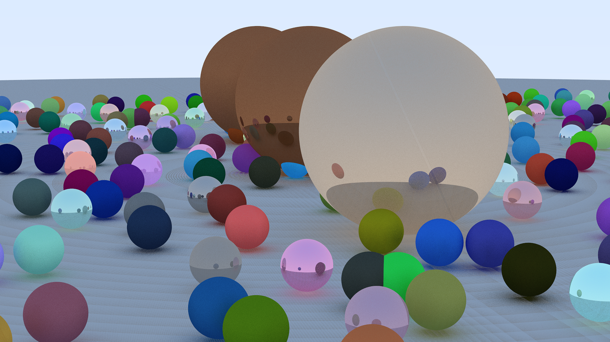
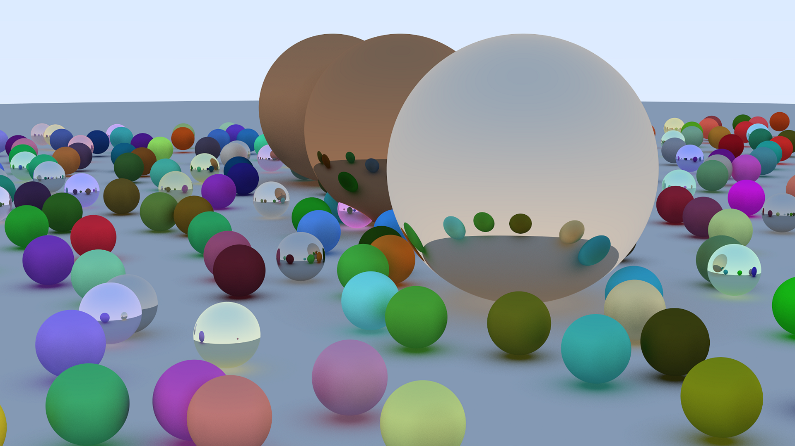

Just a simple raytracer in Rust using the CPU.

Showcase :


This scene rendering runtime took 40 minutes on my laptop.


**Performance Benchmarks**

To evaluate the efficiency of different rendering pipelines, I compared the
execution times of several implementation strategies. All benchmarks were
executed using `cargo run --release`.

*   **Direct stdout stream:** 11.174s total (11.04s user)
*   **Buffered image-to-stdout:** 9.808s total (9.80s user)
*   **Binary P3 format implementation:** 9.503s total (9.48s user)

While the transition to binary output provided measurable performance gains,
the overall impact on total render time remains marginal.


**Parallelization with Rayon**

By integrating the `rayon` crate, I parallelized the rendering process to leverage multi-core CPU architectures. 

```rust
    {
        // Parallelization requires collecting pixels into a vector before 
        // reconstruction, as direct mutation is not thread-safe.
        let pixels: Vec<Vector3> = (0..self.height)
            .into_par_iter()
            .flat_map(|y| {
                (0..self.width).into_par_iter().map(move |x| {
                    let mut pixel_f = Vector3::new(0.0, 0.0, 0.0);

                    for _ in 0..self.samples_per_pixel {
                        let mut hit_record = HitRecord::new();
                        hit_record.t_min = EPSILON;
                        hit_record.t_max = INFINITY;

                        let mut recursion_depth = 0;

                        let ray = get_ray_at_coordinates(x, y, &self.camera);
                        pixel_f =
                            pixel_f + self.ray_color(ray, &mut hit_record, &mut recursion_depth);
                    }

                    pixel_f * (1.0 / self.samples_per_pixel as f32)
                })
            })
            .collect();

        Imagef32 {
            width: self.width,
            height: self.height,
            pixels,
        }
    }
```

**Performance Results**
*   **Execution Time:** 2.956s total (32.55s user, 1101% CPU utilization).
*   **Trade-off:** This approach significantly improves throughput but sacrifices real-time progress reporting in the console.

**Output Sample (Rendered in 1 minute 44 seconds)**




**Development and Optimization**

The Rust ecosystem significantly streamlined the development process. In particular, the `rayon` crate provided an ergonomic and efficient solution for implementing data parallelism with minimal overhead.

During development, a visual artifacting issue was identified, stemming from inconsistent state initialization within the `HitRecord` struct (a discrepancy between `.reset()` and `::new()`). This has since been resolved, ensuring rendering accuracy.

**Enhanced Monitoring and High-Resolution Rendering**

To facilitate longer, high-complexity renders, I integrated the `indicatif` crate to provide a thread-safe progress bar. This allows for real-time tracking of multi-threaded workloads:

`[00:00:04][######>---------------------------------] 174/1080 (25s)`

The following high-quality render was completed in **8 minutes**, utilizing all available CPU cores while maintaining system stability for background tasks.



**Performance Impact: 40 Minutes vs. 8 Minutes**

The transition from a 40-minute sequential render to an 8-minute parallelized render represents a **5x increase in performance (an 80% reduction in wall-clock time)**. 

While the sequential implementation was bottlenecked by single-core throughput, the parallel implementation effectively saturates the CPU's computational capacity. This optimization shifts the project from a proof-of-concept into a functional tool capable of producing high-fidelity images in a fraction of the time.


xxxx

Now let's look at hit_record, this struct is wastful for a lot of bits because of padding.


```rust
// using :
#[repr(C)]
pub struct HitRecord {
    pub point: Vector3,   // 12 bytes
    pub normal: Vector3,  // 12 bytes
    pub t: f32,           // 4 bytes
    pub t_min: f32,       // 4 bytes
    pub t_max: f32,       // 4 bytes
    pub front_face: bool, // 1 byte
}
```
The gaing is minimum, but it scales up with a lot of new allocations.
